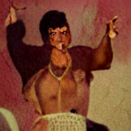
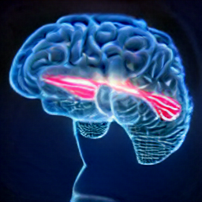
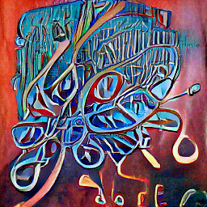

# Fidi
A DALL-E fork<br>
```
start INSTALL.bat
start RUN.bat
```
# Samples
</img></img><br>
</img></img>
# Thank you
https://stackhowto.com/batch-file-to-get-input-from-user/<br>
https://github.com/openai/DALL-E<br>
https://github.com/kuprel/min-dalle<br>
https://github.com/Qirias/Python-Image-Upscale<br>
